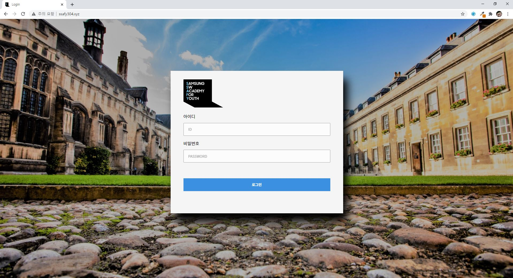
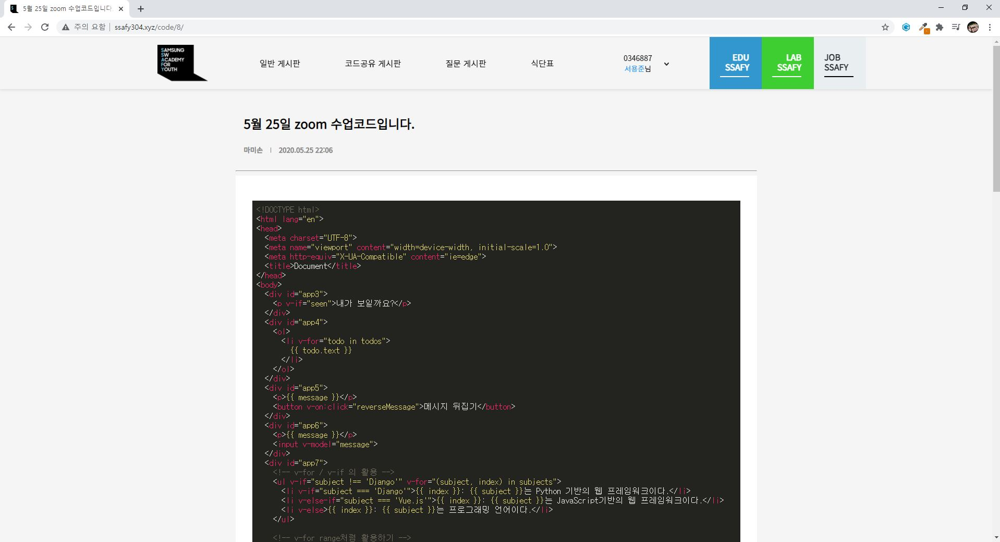
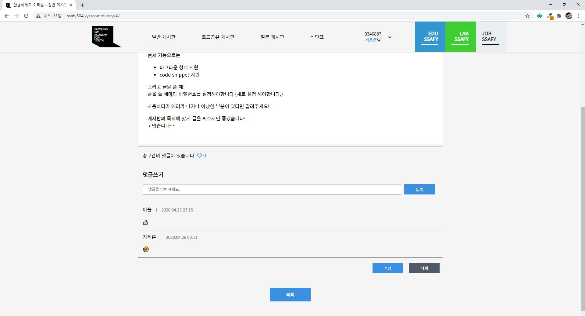
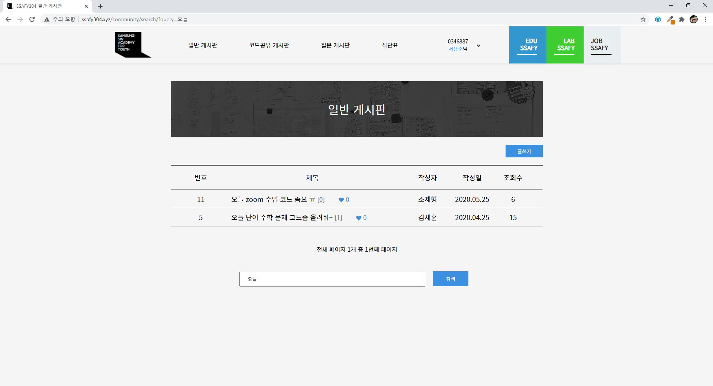

 

 

## 📋 Board304

[`Board304`](http://ssafy304.xyz/)는 삼성 청년 소프트웨어 아카데미(SSAFY) 3기 4반 교육생이 이용하는 게시판입니다.

자유롭게 얘기할 수 있는 게시판, 코드를 공유할 수 있는 게시판, 질문 게시판이 있으며

SSAFY 교육 사이트, SSAFY 취업 지원 사이트 등으로 쉽게 갈 수 있도록 헤더에 링크되어있습니다.

마크다운 형식을 지원합니다.

 

### 개발 동기

> 함께 교육받는 동기들과 알고리즘 스터디를 했는데, 문제를 푼 후에 코드를 공유할 방법이 마땅히 없었습니다.
>
> 구글 스프레드 시트에 코드를 복사해서 붙여넣는 방식으로 코드를 공유했지만 상당히 불편했습니다.
>
> 또한, 반별로 정보를 공유할 수 있는 창구가 없었습니다.
>
> 그래서 4반 교육생끼리 정보도 공유할 수 있고 코드 형식의 글을 보기 편하게 작성해서 공유할 수 있는 게시판을 만들게 되었습니다.

 

 

## 📌 목차 

- [사용된 기술](#-사용된-기술)
- [주요 기능](#-주요-기능)
- [지원하는 브라우저](#-지원하는-브라우저)
- [개발자](#-개발자)

 

 

## 🔨 사용된 기술

- Django
- sqlite3
- Vanilla JS, CSS
- Heroku

 

 

## ✅ 주요 기능

- 코드 블럭
  - highlight.js를 이용하여 191개의 컴퓨터 언어에 대한 코드 스타일 적용

 

- 댓글, 좋아요 기능

 

- 검색 기능 및 조회수

 

 

## 🌏 지원하는 브라우저

|  |  |  |  |
| :----------------------------------------------------------: | :----------------------------------------------------------: | :----------------------------------------------------------: | :----------------------------------------------------------: |
|                            latest                            |                            latest                            |                            latest                            |                            latest                            |

 

 

## 👩‍💻 개발자

- 서용준 (https://github.com/YongjoonSeo)

